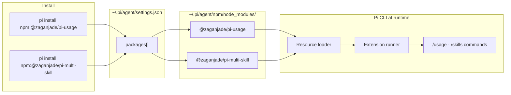
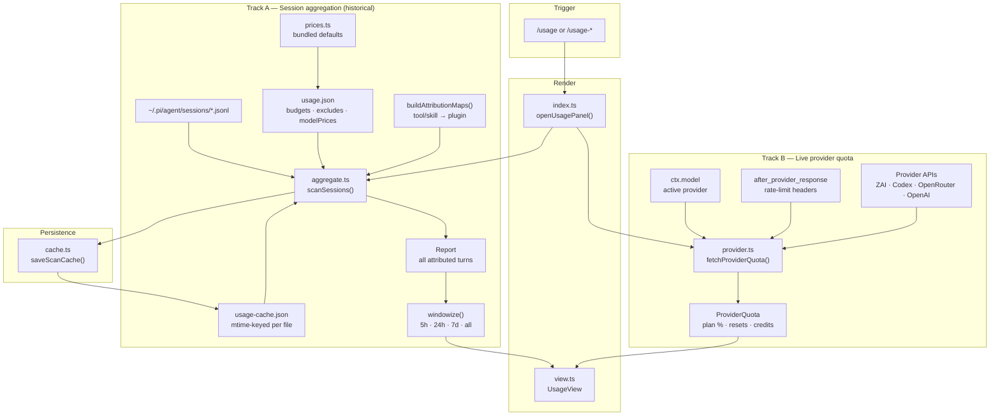
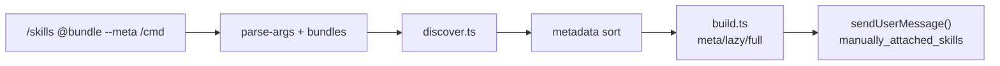

<div align="center">

# 🛰️ Pi Extensions

### Supercharge your [pi](https://github.com/earendil-works/pi-mono) coding agent with a Claude Code-style usage panel and multi-skill loader.

[](https://www.npmjs.com/package/@zaganjade/pi-usage)
[](https://www.npmjs.com/package/@zaganjade/pi-multi-skill)
[](https://opensource.org/licenses/MIT)
[](https://pi.dev/packages)

</div>

---

## 🚀 Install

Pi extensions **must be registered with `pi install`**. Plain `npm install` only downloads files — pi will not load them unless they appear under `"packages"` in `~/.pi/agent/settings.json`.

### Step 1 — Install from npm (recommended)

```bash
pi install npm:@zaganjade/pi-usage
pi install npm:@zaganjade/pi-multi-skill
pi install npm:@zaganjade/pi-context
```

### Step 2 — Reload pi

Inside pi, run:

```
/reload
```

Or restart the pi CLI.

### Step 3 — Verify

```bash
pi list
```

You should see both packages with install paths. Then open pi and type `/` — `/usage` and `/skills` should appear in slash autocomplete.

### Other install methods

**GitHub (whole monorepo):**

```bash
pi install git:github.com/ZaganJade/pi-extension
/reload
```

**Local path (development):**

```bash
git clone https://github.com/ZaganJade/pi-extension.git
cd pi-extension
pi install ./usage
pi install ./multi-skill
/reload
```

**Try without saving to settings:**

```bash
pi -e npm:@zaganjade/pi-usage
pi -e npm:@zaganjade/pi-multi-skill
```

### ⚠️ Common mistakes

| What people try | Why it fails |
|-----------------|--------------|
| `npm install -g @zaganjade/pi-usage` | Package lands in npm's folder; pi never registers it |
| Adding `npm:...` to `"extensions"` in settings | Wrong key — npm packages belong in `"packages"` |
| Install but forget `/reload` | Extension not loaded until reload or restart |
| Extension disabled in `pi config` | Re-enable the extension resource for that package |

> No build step — pi loads TypeScript directly via jiti.

Per-extension docs: [usage/README.md](./usage/README.md) · [multi-skill/README.md](./multi-skill/README.md) · [Pi-Context/README.md](./Pi-Context/README.md)

---

## 🧠 How it works (pi package system)

This repo is a **monorepo of two independent [pi packages](https://pi.dev/packages)**. Each package ships its own `package.json` with a `pi.extensions` manifest. Pi's package manager reads that manifest, installs the tarball to `~/.pi/agent/npm/`, and loads the declared entry points at startup.



| Mechanism | Settings key | What it loads |
|-----------|--------------|---------------|
| `pi install npm:...` | `"packages"` | npm/git packages with `pi` manifest |
| Local path in settings | `"extensions"` | Folder or file on disk (dev workflow) |
| Auto-discovery | — | `~/.pi/agent/extensions/` |

Both extensions are **standalone npm packages** — install one or both. They do not depend on each other.

---

## 📦 What's inside

| Extension | npm | One-liner |
|-----------|-----|-----------|
| **📊 pi-usage** | [`@zaganjade/pi-usage`](https://www.npmjs.com/package/@zaganjade/pi-usage) | Claude Code-style `/usage` dashboard — Pi-chan navigation, quota bars, attribution, Wrapped AI year-in-review |
| **⚡ pi-multi-skill** | [`@zaganjade/pi-multi-skill`](https://www.npmjs.com/package/@zaganjade/pi-multi-skill) | Chain skills via `/skills` — bundles, load modes, BMAD `--auto`, universal discovery |
| **◈ pi-context** | [`@zaganjade/pi-context`](https://www.npmjs.com/package/@zaganjade/pi-context) | Live `/context` window tracker — category breakdown, dot grid, cross-model handoff (GLM → GPT) |

---

## 📊 pi-usage

Real-time usage dashboard for pi. Mirrors Claude Code's `/usage` screen but works with **any provider** — ZAI, OpenAI Codex, OpenRouter, Anthropic, custom routers, and more. The panel includes **Pi-chan**, a lightweight mascot that guides navigation and appears in the Wrapped AI year-in-review.

### Preview — Overview (`/usage`)

Seven views via `Tab` or `1`–`7`. A **two-row menu** shows icon tabs plus Pi-chan with a contextual hint. Overview shows always-on quota bars, headline stats, active provider, top consumer, a 30-day trend sparkline, and compact top models.

```
────────────────────────────────────────────────────────────────
 Usage ────────────────────────────────  5H │ DAY │ WEEK │ ALL

╭─ views  ◈1 Overview │ ◎2 Models │ … │ ✦7 Wrapped  ─────────╮
  (◕‿◕)  Pi-chan  Quota bars & headline stats…    Tab · 1-7 jump

  Showing: last 24 hours              last activity 2m ago  ·  254 sessions

  5-hour quota     ████░░░░░░░░░░░░  12% used / 145.9M · 88% left
  ↑51.8M  ↓3.7M  ⚡97.7M  145.9M tokens   ·  855 turns

  Top consumer
  73% of usage came from model glm-5.2

  → Tab or 1-7 to explore · ✦7 opens Wrapped AI
```

### Preview — Models view (`/usage-models`)

Full breakdown: model table with tok/s, Skills, **Bundles** (`@debug`, `@bmad-planning`, …), Plugin usage, **Tools** (glyph + bar per tool), and Projects. Multi-skill chains from **pi-multi-skill** attribute every skill and bundle separately.

```
  Models                            %   tokens   tok/s
  glm-5.2                        73% ███████████████ 106.5M   142/s

  Skills                            %   tokens
  systematic-debugging             18% ███░░░░░░░░░░░░  25.4M
  frontend-design                  12% ██░░░░░░░░░░░░░  16.1M

  Bundles                           %   tokens
  @debug                           22% ████░░░░░░░░░░░  31.1M
  @cc-feature                      15% ███░░░░░░░░░░░░  21.0M

  ⚙ Pi-chan tracked these tool calls
  Tools                             %   tokens
  ↳ read                         34% ██████░░░░░░░░░  48.2M
  $ bash                         22% ████░░░░░░░░░░░  31.1M
```

### Preview — Wrapped AI (`/usage-wrapped`)

Year-in-review with report-style sections, Stats-style **monthly heatmap**, rankings, and a Pi-chan footer caption. Mascot pose reacts to streaks and peak hours.

```
  Wrapped  2025  ◂ [ ] ▸  ·  y ─────────────────────────────
  ∧＿∧ │  145.9M tokens  ·  855 turns  ·  89 active days
 (◕‿◕)│  Highlights ── Monthly heatmap ── Rankings
  Monthly activity
  tokens by month
      ███     ░░░
  Jan Feb Mar … Dec
  Less ·▪▩█ More  ·  Peak month Mar 48.2M
 (≧◡≦) │  Pi-chan  73% of usage on glm-5.2.
```

### Features

- **Pi-chan navigation** — two-row menu with icon tabs, per-view hints, and mascot accents in Wrapped AI
- **Live upstream quota** — 5H/weekly bars from ZAI and OpenAI Codex using pi's own credentials
- **Rate-limit windows** — captures provider HTTP headers on every response with live reset countdowns
- **Full attribution** — breakdown by model, skill, **bundle**, plugin, tool (with glyphs), and project
- **Multi-skill aware** — every skill and `@bundle` in a `/skills` chain counted separately (pairs with pi-multi-skill)
- **Seven TUI views** — Overview, Models, Daily, Stats, Hourly, Agents, Wrapped AI
- **Wrapped AI** — professional year-in-review layout with Pi-chan sidebar and data-driven footer caption
- **Adaptive units** — USD for priced providers, tokens for token-priced providers (ZAI/GLM)
- **Incremental cache** — session scan cached to `~/.pi/agent/usage-cache.json` (v4, multi-skill + bundle safe)
- **Always-on widget** — optional compact spend line above the editor (`/usage-widget`)

### Commands

| Command | Description |
|---------|-------------|
| `/usage` | Open the interactive usage panel |
| `/usage-models` · `/usage-daily` · `/usage-stats` · `/usage-wrapped` · … | Jump directly to a specific view |
| `/usage-config` | Set 5H/weekly USD & token budgets |
| `/usage-pricing` | Set manual per-model prices for token-priced providers |
| `/usage-widget` | Toggle compact always-on spend widget |

**Latest (v1.9.0):** Pi-chan two-row navigation · Wrapped AI report layout · monthly heatmap · Tools glyphs · bundle attribution · cache v4 with legacy turn normalization.

### Provider quota

| Provider | Source |
|----------|--------|
| **ZAI (GLM plans)** | `api.z.ai` subscription quota API |
| **OpenAI Codex** | Live rate-limit headers from pi's Codex requests |
| **OpenRouter** | `/api/v1/credits` |
| **OpenAI (metered)** | `/v1/organization/costs` |
| **Any provider** | `after_provider_response` rate-limit headers |

---

## ⚡ pi-multi-skill

Pi's built-in `/skill:name` loads one skill at a time. **pi-multi-skill** (v1.3.0) chains multiple skills in one command with bundles, load modes, BMAD auto-routing, conflict resolution, parallel dispatch, activation stats, and Claude Code-style orchestration.

Full reference: [multi-skill/README.md](./multi-skill/README.md)

### Usage

```
/skills frontend-design,motion-design Create an animated landing page
/skills @bmad-planning --meta Buat PRD untuk fitur X
/skills bmad-master /workflow-status
/skills @bmad-planning --auto
/skills @cc-feature --parallel Build API | Write tests
/skills-stats                         → activation statistics
/skills-last --meta                   → repeat last activation
/skills-setup                         → bundle prerequisites + install guide
/skills                              → show help + list skills & bundles
```

### Commands

| Command | Description |
|---------|-------------|
| `/skills` | Chain skills/bundles with load modes, passthrough, `--auto`, `--parallel` |
| `/skills-stats` | Activation stats (modes, bundles, recent history) |
| `/skills-last` | Repeat last `/skills` invocation (optional flag override) |
| `/skills-setup` | Bundle readiness report + BMAD/Superpowers install hints |

### What's new in v1.3.0

| Feature | Description |
|---------|-------------|
| **`/skills-last`** | Replay last activation; override with `--meta` / `--lazy` / `--full` / `--parallel` |
| **BMAD status pre-inject** | `<bmad_status>` block for `/workflow-status`, `--auto`, and `bmad-master` |
| **Bundle attribution** | `bundles="@name"` on `<manually_attached_skills>` → tracked in pi-usage **Bundles** section |
| **`/skills-setup`** | On-machine bundle coverage + install guide for BMAD/Superpowers/custom bundles |

### What's new in v1.2.0

| Category | Features |
|----------|----------|
| **Conflicts** | `conflicts_with` frontmatter — auto-skip conflicting skills with notification |
| **Token budget** | Per-skill `token_budget` override within a bundle load mode |
| **Parallel** | `<parallel_dispatch>` JSON template for `pi-subagents`; pipe-separated tasks |
| **Stats** | `/skills-stats` + `~/.pi/agent/multi-skill-stats.json` activation tracking |
| **Bundles** | YAML config (`skill-bundles.yaml`) alongside JSON |

### v1.1.0 highlights

| Category | Features |
|----------|----------|
| **Bundles** | `@bmad-planning`, `@bmad-solutioning`, `@bmad-build`, `@cc-feature`, `@debug` + custom JSON config |
| **Load modes** | `--meta` (minimal tokens), `--lazy` (on-demand refs), `--full` (default) |
| **Orchestration** | Smart ordering (process → planning → impl), deduplication, `<manually_attached_skills>` wrapper |
| **BMAD** | `--auto` reads workflow status and loads phase-appropriate skills |
| **Commands** | Passthrough: `/skills bmad-master /workflow-status` |
| **Discovery** | Pi commands + settings paths + **Claude plugin cache** + Cursor skills |
| **Session** | Bundle suggestions after user turns; `skill-index.json` rebuilt each session |
| **Usage** | Multi-skill attribution — all skills counted in `pi-usage` `/usage-models` |

### All features

- **Parallel dispatch** — `--parallel Task A | Task B` with structured subagent template
- **Conflict resolution** — `conflicts_with` frontmatter deduplication
- **Activation stats** — `/skills-stats` tracks modes, bundles, recent history
- **YAML bundles** — `skill-bundles.yaml` alongside JSON config
- **Skill bundles** — `@name` expands to curated skill sets; merge with `~/.pi/agent/skill-bundles.json`
- **Load modes** — control token cost per activation
- **Smart ordering** — process skills first, then planning, then implementation
- **Command passthrough** — embed `/workflow-status`, `/dev-story`, etc.
- **BMAD `--auto`** — phase detection from `docs/bmm-workflow-status.yaml`
- **Universal discovery** — finds Superpowers skills in Claude plugin cache even if not in pi `"skills"` paths
- **Autocomplete** — skills and bundles with descriptions; comma-chaining support
- **Legacy formats** — `/skills:name1,name2` and `/skill:name1+name2`
- **Parallel hint** — `--parallel` with pipe-separated tasks; JSON template when `pi-subagents` installed
- **pi-usage integration** — every skill and `@bundle` in a chain attributed separately in `/usage-models`

---

## 📋 Latest releases

| Package | Version | Highlights |
|---------|---------|------------|
| `@zaganjade/pi-usage` | **1.9.0** | Pi-chan menu · Wrapped report · monthly heatmap · Tools glyphs · bundle breakdown · cache v4 |
| `@zaganjade/pi-multi-skill` | **1.3.0** | `/skills-last` · `/skills-setup` · BMAD status inject · bundle attribution for usage |
| `@zaganjade/pi-context` | **0.2.0** | Claude Code–style context panel · scannable table · compact grid |

---

## 🏗️ Architecture

Monorepo layout:

```
pi-extension/
├── usage/                  → @zaganjade/pi-usage
│   └── src/
│       ├── index.ts        orchestrator — commands, events, scan + quota coordination
│       ├── view.ts         TUI panel (UsageView, 7 views, Pi-chan menu)
│       ├── mascot.ts       Pi-chan art, view icons, tool glyphs
│       ├── aggregate.ts    session scan, attribution, multi-skill windowing
│       ├── provider.ts     live quota fetch + rate-limit parsing
│       ├── config.ts       ~/.pi/agent/usage.json
│       ├── cache.ts        ~/.pi/agent/usage-cache.json
│       ├── prices.ts       bundled default model prices
│       └── format.ts       token / currency / bar helpers
└── multi-skill/            → @zaganjade/pi-multi-skill
    └── src/
        ├── index.ts        /skills, /skills-stats, events, orchestration
        ├── discover.ts     universal skill discovery
        ├── bundles.ts      preset + user bundle loading (JSON/YAML)
        ├── metadata.ts     frontmatter, priority sorting
        ├── build.ts        message builder, load modes, parallel dispatch
        ├── conflicts.ts    conflicts_with resolution
        ├── subagents.ts    pi-subagents detection + dispatch template
        ├── stats.ts        activation tracking
        ├── yaml-bundles.ts YAML bundle parser
        ├── bmad-auto.ts    BMAD phase auto-routing
        ├── bmad-status.ts  BMAD workflow status pre-inject
        ├── bundle-status.ts bundle readiness + /skills-setup report
        ├── completions.ts  slash autocomplete for skills & commands
        ├── parse-args.ts   flags & embedded commands
        ├── registry.ts     skill-index.json
        ├── suggestions.ts  context-aware hints
        └── types.ts        shared types
└── Pi-Context/             → @zaganjade/pi-context
    └── src/
        ├── index.ts        /context, handoff commands, events, widget
        ├── snapshot.ts     live category snapshot from session + prompt
        ├── estimate.ts     per-category token estimation
        ├── view.ts         ContextView TUI (bar + grid + list)
        ├── handoff.ts      export/import/scale Context Pack
        ├── config.ts       ~/.pi/agent/context.json
        └── mascot.ts       Context-chan hints
```

### pi-usage data flow

Opening `/usage` runs **two independent pipelines in parallel** — session history (historical attribution) and provider quota (live upstream state). They merge only at render time inside `UsageView`.



**Step-by-step when `/usage` opens:**

| Step | Module | What happens |
|------|--------|--------------|
| 1 | `index.ts` | Creates `UsageView`, binds TUI, kicks off scan + quota fetch |
| 2a | `cache.ts` | Loads `usage-cache.json`; skips unchanged session files (mtime + size) |
| 2b | `aggregate.ts` | Parses new/changed JSONL → attributes each turn to model, project, skill, plugin, tool |
| 2c | `config.ts` + `prices.ts` | Applies budgets, excludes, and manual/bundled model prices at parse time |
| 3 | `provider.ts` | Fetches upstream quota (ZAI plan %, Codex headers, etc.) + merges captured rate limits |
| 4 | `view.ts` | `windowize()` slices `Report` by selected window; renders Overview / Models / … / Wrapped |
| 5 | `cache.ts` | Writes updated scan cache back to disk |

**Background events (outside the panel):**

| Event | Effect |
|-------|--------|
| `session_start` | Rebuild `AttributionMaps` from `pi.getAllTools()` / `pi.getCommands()` |
| `after_provider_response` | Capture rate-limit headers for next quota refresh |
| `model_select` | Update active provider; refresh spend widget |
| `turn_end` | Refresh always-on widget from current session branch |

**Attribution model:** skills, plugins, tools, and models are *independent characteristics* — one turn can count toward several buckets (like Claude Code). Percentages across categories do not sum to 100%.

### pi-multi-skill flow



### Extension API surface

Both packages are standard pi extensions — a default-export factory receiving `ExtensionAPI`:

| API used | pi-usage | pi-multi-skill |
|----------|----------|----------------|
| `pi.registerCommand()` | `/usage`, `/usage-*`, `/usage-config`, … | `/skills`, `/skills-stats`, `/skills-last`, `/skills-setup` |
| `pi.on("session_start")` | rebuild attribution maps | clear cache + skill index |
| `pi.on("after_provider_response")` | capture rate-limit headers | — |
| `pi.on("model_select")` / `turn_end` | refresh spend widget | skill bundle suggestions |
| `pi.on("input")` | — | legacy `/skills:` / `/skill:+` formats |
| `pi.getCommands()` / `loadSkills()` | tool/plugin attribution | skill discovery (via discover.ts) |
| `pi.sendUserMessage()` | — | inject combined skills |
| `pi.ui.custom()` / `setWidget()` | panel + always-on widget | — |

---

## ⚙️ Configuration (pi-usage)

`~/.pi/agent/usage.json` (auto-created on first `/usage-config`):

```json
{
  "fiveHourLimit": 20,
  "weeklyLimit": 100,
  "fiveHourTokenLimit": 2000000,
  "weeklyTokenLimit": 10000000,
  "showWidget": false,
  "excludeProjects": ["/tmp/throwaway"],
  "maxSessions": 1000
}
```

| Key | Description |
|-----|-------------|
| `fiveHourLimit` / `weeklyLimit` | USD budgets for priced providers |
| `fiveHourTokenLimit` / `weeklyTokenLimit` | Token budgets for token-priced providers (ZAI/GLM) |
| `showWidget` | Compact one-line spend summary above the editor |
| `excludeProjects` | Project cwd prefixes to skip during aggregation |
| `maxSessions` | Safety cap on session files to scan |

Full reference: [usage/README.md](./usage/README.md)

---

## 📄 License

MIT — see [LICENSE](./usage/LICENSE).

<div align="center">

**Made with ❤️ for the [pi](https://github.com/earendil-works/pi-mono) community**

[Report a bug](https://github.com/ZaganJade/pi-extension/issues) · [Request a feature](https://github.com/ZaganJade/pi-extension/issues) · [npm: @zaganjade](https://www.npmjs.com/~zaganjade)

</div>
