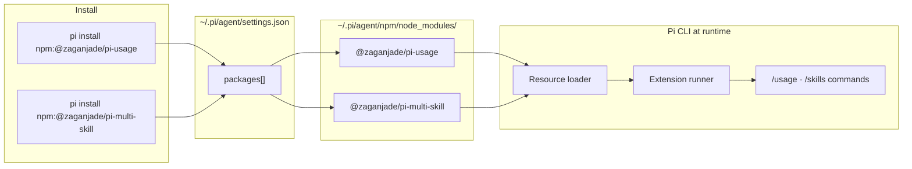
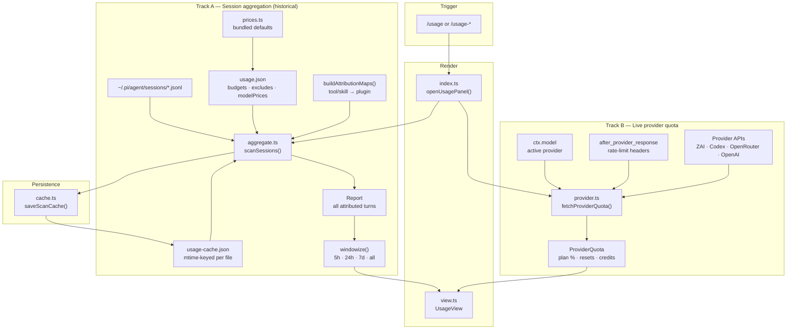
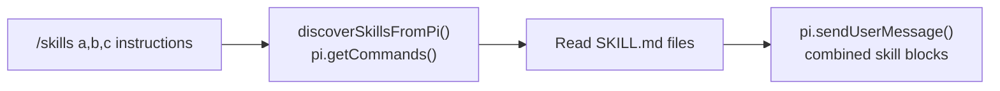

<div align="center">

# 🛰️ Pi Extensions

### Supercharge your [pi](https://github.com/earendil-works/pi-mono) coding agent with a Claude Code-style usage panel and multi-skill loader.

[](https://www.npmjs.com/package/@zaganjade/pi-usage)
[](https://www.npmjs.com/package/@zaganjade/pi-multi-skill)
[](https://opensource.org/licenses/MIT)
[](https://pi.dev/packages)

</div>

---

## 🚀 Install

Pi extensions **must be registered with `pi install`**. Plain `npm install` only downloads files — pi will not load them unless they appear under `"packages"` in `~/.pi/agent/settings.json`.

### Step 1 — Install from npm (recommended)

```bash
pi install npm:@zaganjade/pi-usage
pi install npm:@zaganjade/pi-multi-skill
```

### Step 2 — Reload pi

Inside pi, run:

```
/reload
```

Or restart the pi CLI.

### Step 3 — Verify

```bash
pi list
```

You should see both packages with install paths. Then open pi and type `/` — `/usage` and `/skills` should appear in slash autocomplete.

### Other install methods

**GitHub (whole monorepo):**

```bash
pi install git:github.com/ZaganJade/pi-extension
/reload
```

**Local path (development):**

```bash
git clone https://github.com/ZaganJade/pi-extension.git
cd pi-extension
pi install ./usage
pi install ./multi-skill
/reload
```

**Try without saving to settings:**

```bash
pi -e npm:@zaganjade/pi-usage
pi -e npm:@zaganjade/pi-multi-skill
```

### ⚠️ Common mistakes

| What people try | Why it fails |
|-----------------|--------------|
| `npm install -g @zaganjade/pi-usage` | Package lands in npm's folder; pi never registers it |
| Adding `npm:...` to `"extensions"` in settings | Wrong key — npm packages belong in `"packages"` |
| Install but forget `/reload` | Extension not loaded until reload or restart |
| Extension disabled in `pi config` | Re-enable the extension resource for that package |

> No build step — pi loads TypeScript directly via jiti.

Per-extension docs: [usage/README.md](./usage/README.md) · [multi-skill/README.md](./multi-skill/README.md)

---

## 🧠 How it works (pi package system)

This repo is a **monorepo of two independent [pi packages](https://pi.dev/packages)**. Each package ships its own `package.json` with a `pi.extensions` manifest. Pi's package manager reads that manifest, installs the tarball to `~/.pi/agent/npm/`, and loads the declared entry points at startup.



| Mechanism | Settings key | What it loads |
|-----------|--------------|---------------|
| `pi install npm:...` | `"packages"` | npm/git packages with `pi` manifest |
| Local path in settings | `"extensions"` | Folder or file on disk (dev workflow) |
| Auto-discovery | — | `~/.pi/agent/extensions/` |

Both extensions are **standalone npm packages** — install one or both. They do not depend on each other.

---

## 📦 What's inside

| Extension | npm | One-liner |
|-----------|-----|-----------|
| **📊 pi-usage** | [`@zaganjade/pi-usage`](https://www.npmjs.com/package/@zaganjade/pi-usage) | Claude Code-style `/usage` dashboard — quota bars, cost/token breakdowns, live upstream provider quota |
| **⚡ pi-multi-skill** | [`@zaganjade/pi-multi-skill`](https://www.npmjs.com/package/@zaganjade/pi-multi-skill) | Chain multiple skills in one command via `/skills skill1,skill2` |

---

## 📊 pi-usage

Real-time usage dashboard for pi. Mirrors Claude Code's `/usage` screen but works with **any provider** — ZAI, OpenAI Codex, OpenRouter, Anthropic, custom routers, and more.

### Preview — Overview (`/usage`)

Seven views via `Tab` or `1`–`7`. Overview shows always-on quota bars, headline stats, active provider, top consumer, a 30-day trend sparkline, and compact top models.

```
────────────────────────────────────────────────────────────────
 Usage ────────────────────────────────  5H │ DAY │ WEEK │ ALL

   1 Overview │ 2 Models │ 3 Daily │ 4 Stats │ 5 Hourly │ 6 Agents │ 7 Wrapped

  Showing: last 24 hours              last activity 2m ago  ·  254 sessions

  5-hour quota     ████░░░░░░░░░░░░  12% used / 145.9M · 88% left · resets 4h 58m
  Weekly quota     ██████░░░░░░░░░░  55% used / 176.7M · 45% left · resets 11h 49m
  live from provider
  max plan · upstream quota
  Web searches  0/4000

  ↑51.8M  ↓3.7M  ⚡97.7M  145.9M tokens   ·  855 turns

  Active provider
  zai / glm-5.2  api.z.ai  key ✓
  Rate limits (live, from last response)
  tokens/min       ████████░░░░  12.4K/16K  resets in 42s

  Top consumer
  73% of usage came from model glm-5.2

  Trend  ▁▂▃▅▆▅▄▃▂▁▂▃  Jun 10 → Jun 17

  Top models                        %   tokens
  glm-5.2                        73% ███████████████ 106.5M
  glm-5.1                        11% ██░░░░░░░░░░░░░  16.1M
  gpt-5.5                         8% █░░░░░░░░░░░░░░  11.2M

  → Tab for views · 2 Models · 3 Daily · 5 Hourly · 7 Wrapped AI
```

### Preview — Models view (`/usage-models`)

Full breakdown: model table with tok/s, plus Skills, Plugin usage (with contributing skills/tools), Tools, and Projects.

```
  Models                            %   tokens   tok/s
  glm-5.2                        73% ███████████████ 106.5M   142/s
  glm-5.1                        11% ██░░░░░░░░░░░░░  16.1M    98/s
  tok/s · est. avg output speed

  Plugin usage                      %   tokens  via
  frontend-design                12% ██░░░░░░ 720k   frontend-design
  bmad                           12% ██░░░░░░ 720k   bmad-master, analyst
  pi-subagents                    7% █░░░░░░░ 450k   subagent
  (core / no plugin)             59% ██████░░ 3.6M   builtin tools only
```

### Features

- **Live upstream quota** — 5H/weekly bars from ZAI and OpenAI Codex using pi's own credentials
- **Rate-limit windows** — captures provider HTTP headers on every response with live reset countdowns
- **Full attribution** — breakdown by model, skill, plugin, tool, and project
- **Seven TUI views** — Overview, Models, Daily, Stats, Hourly, Agents, Wrapped AI
- **Adaptive units** — USD for priced providers, tokens for token-priced providers (ZAI/GLM)
- **Incremental cache** — session scan cached to `~/.pi/agent/usage-cache.json` for fast reopen
- **Always-on widget** — optional compact spend line above the editor (`/usage-widget`)

### Commands

| Command | Description |
|---------|-------------|
| `/usage` | Open the interactive usage panel |
| `/usage-models` · `/usage-daily` · `/usage-stats` · … | Jump directly to a specific view |
| `/usage-config` | Set 5H/weekly USD & token budgets |
| `/usage-pricing` | Set manual per-model prices for token-priced providers |
| `/usage-widget` | Toggle compact always-on spend widget |

### Provider quota

| Provider | Source |
|----------|--------|
| **ZAI (GLM plans)** | `api.z.ai` subscription quota API |
| **OpenAI Codex** | Live rate-limit headers from pi's Codex requests |
| **OpenRouter** | `/api/v1/credits` |
| **OpenAI (metered)** | `/v1/organization/costs` |
| **Any provider** | `after_provider_response` rate-limit headers |

---

## ⚡ pi-multi-skill

Pi's built-in `/skill:name` loads one skill at a time. This extension lets you **chain multiple skills** in a single slash command.

### Usage

```
/skills frontend-design,motion-design Create an animated landing page
/skills test-driven-development,systematic-debugging Fix the failing tests
/skills                              → show help + list available skills
```

### Features

- **Comma-separated chaining** — `/skills skill1,skill2,skill3 [instructions]`
- **Smart autocomplete** — shows all skills with descriptions; selecting one appends a comma for chaining
- **Universal discovery** — finds skills from user, project, npm, and git sources via `pi.getCommands()`
- **Legacy formats** — `/skills:name1,name2` and `/skill:name1+name2` also supported
- **Inline instructions** — text after the skill list is passed to the agent alongside skill content

---

## 🏗️ Architecture

Monorepo layout:

```
pi-extension/
├── usage/                  → @zaganjade/pi-usage
│   └── src/
│       ├── index.ts        orchestrator — commands, events, scan + quota coordination
│       ├── view.ts         TUI panel (UsageView, 7 views)
│       ├── aggregate.ts    session scan, attribution, windowing
│       ├── provider.ts     live quota fetch + rate-limit parsing
│       ├── config.ts       ~/.pi/agent/usage.json
│       ├── cache.ts        ~/.pi/agent/usage-cache.json
│       ├── prices.ts       bundled default model prices
│       └── format.ts       token / currency / bar helpers
└── multi-skill/            → @zaganjade/pi-multi-skill
    └── src/
        └── index.ts        /skills command, autocomplete, input handler
```

### pi-usage data flow

Opening `/usage` runs **two independent pipelines in parallel** — session history (historical attribution) and provider quota (live upstream state). They merge only at render time inside `UsageView`.



**Step-by-step when `/usage` opens:**

| Step | Module | What happens |
|------|--------|--------------|
| 1 | `index.ts` | Creates `UsageView`, binds TUI, kicks off scan + quota fetch |
| 2a | `cache.ts` | Loads `usage-cache.json`; skips unchanged session files (mtime + size) |
| 2b | `aggregate.ts` | Parses new/changed JSONL → attributes each turn to model, project, skill, plugin, tool |
| 2c | `config.ts` + `prices.ts` | Applies budgets, excludes, and manual/bundled model prices at parse time |
| 3 | `provider.ts` | Fetches upstream quota (ZAI plan %, Codex headers, etc.) + merges captured rate limits |
| 4 | `view.ts` | `windowize()` slices `Report` by selected window; renders Overview / Models / … / Wrapped |
| 5 | `cache.ts` | Writes updated scan cache back to disk |

**Background events (outside the panel):**

| Event | Effect |
|-------|--------|
| `session_start` | Rebuild `AttributionMaps` from `pi.getAllTools()` / `pi.getCommands()` |
| `after_provider_response` | Capture rate-limit headers for next quota refresh |
| `model_select` | Update active provider; refresh spend widget |
| `turn_end` | Refresh always-on widget from current session branch |

**Attribution model:** skills, plugins, tools, and models are *independent characteristics* — one turn can count toward several buckets (like Claude Code). Percentages across categories do not sum to 100%.

### pi-multi-skill flow



### Extension API surface

Both packages are standard pi extensions — a default-export factory receiving `ExtensionAPI`:

| API used | pi-usage | pi-multi-skill |
|----------|----------|----------------|
| `pi.registerCommand()` | `/usage`, `/usage-*`, `/usage-config`, … | `/skills` |
| `pi.on("session_start")` | rebuild attribution maps | clear skill cache |
| `pi.on("after_provider_response")` | capture rate-limit headers | — |
| `pi.on("model_select")` / `turn_end` | refresh spend widget | — |
| `pi.on("input")` | — | legacy `/skills:` / `/skill:+` formats |
| `pi.getCommands()` / `getAllTools()` | tool/plugin attribution | skill discovery |
| `pi.sendUserMessage()` | — | inject combined skills |
| `pi.ui.custom()` / `setWidget()` | panel + always-on widget | — |

---

## ⚙️ Configuration (pi-usage)

`~/.pi/agent/usage.json` (auto-created on first `/usage-config`):

```json
{
  "fiveHourLimit": 20,
  "weeklyLimit": 100,
  "fiveHourTokenLimit": 2000000,
  "weeklyTokenLimit": 10000000,
  "showWidget": false,
  "excludeProjects": ["/tmp/throwaway"],
  "maxSessions": 1000
}
```

| Key | Description |
|-----|-------------|
| `fiveHourLimit` / `weeklyLimit` | USD budgets for priced providers |
| `fiveHourTokenLimit` / `weeklyTokenLimit` | Token budgets for token-priced providers (ZAI/GLM) |
| `showWidget` | Compact one-line spend summary above the editor |
| `excludeProjects` | Project cwd prefixes to skip during aggregation |
| `maxSessions` | Safety cap on session files to scan |

Full reference: [usage/README.md](./usage/README.md)

---

## 📄 License

MIT — see [LICENSE](./usage/LICENSE).

<div align="center">

**Made with ❤️ for the [pi](https://github.com/earendil-works/pi-mono) community**

[Report a bug](https://github.com/ZaganJade/pi-extension/issues) · [Request a feature](https://github.com/ZaganJade/pi-extension/issues) · [npm: @zaganjade](https://www.npmjs.com/~zaganjade)

</div>
