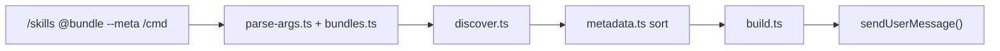

# pi-multi-skill

Load multiple skills at once in [pi](https://github.com/earendil-works/pi-mono) via the `/skills` command — with preset bundles, token-efficient load modes, BMAD auto-routing, and Claude Code-style orchestration.

**Version 1.3.0** — skill chaining, bundle presets, conflict resolution, parallel dispatch, activation stats, `/skills-last`, `/skills-setup`, and bundle attribution in pi-usage.

## Why?

Pi's built-in `/skill:name` loads one skill at a time. When you need several skills working together (e.g. `bmad-master` + `analyst` + `pm`, or `systematic-debugging` + `test-driven-development`), invoking them one by one is slow and easy to forget.

This extension chains skills in a **single command** with:

- Preset **bundles** (`@bmad-planning`, `@debug`, …)
- **Smart ordering** (process → planning → implementation)
- **Load modes** to control token cost (`--meta`, `--lazy`, `--full`)
- **Universal discovery** including Claude Code plugin skills and Cursor skills
- **BMAD `--auto`** phase routing from workflow status files

---

## Quick start

```
/skills @debug --meta Fix the failing auth tests
/skills @bmad-planning --meta Buat PRD untuk fitur notifikasi
/skills bmad-master,developer Implement user story US-042
/skills bmad-master /workflow-status
/skills @bmad-planning --auto
/skills @cc-feature --parallel Build API | Write tests | Update docs
/skills-stats                         → activation statistics
/skills-last                          → repeat last activation
/skills-setup                         → bundle install guide
/skills                              → help + list all skills & bundles
```

---

## Commands

| Command | Description |
|---------|-------------|
| `/skills` | Chain skills/bundles — flags, embedded commands, `--auto`, `--parallel` |
| `/skills-stats` | Activation statistics (`~/.pi/agent/multi-skill-stats.json`) |
| `/skills-last` | Repeat last activation (optional `--meta` / `--lazy` / `--full` / `--parallel`) |
| `/skills-setup` | Bundle readiness on this machine + BMAD/Superpowers install guide |

---

## Features

### v1.3.0

| Feature | Description |
|---------|-------------|
| **`/skills-last`** | Replay the previous `/skills` line; flags can override load mode |
| **BMAD status inject** | `<bmad_status>` preloaded for `/workflow-status`, `--auto`, `bmad-master` |
| **Bundle attribution** | Sets `bundles="@name"` on `<manually_attached_skills>` for pi-usage tracking |
| **`/skills-setup`** | Reports which preset bundles are usable + how to install missing skills |

### Skill chaining

| Feature | Description |
|---------|-------------|
| **Comma-separated skills** | `/skills skill1,skill2,skill3 [instructions]` |
| **Preset bundles** | `/skills @bundle-name` expands to a curated skill set |
| **Mixed input** | Combine bundles and individual skills: `/skills @debug,frontend-design` |
| **Inline instructions** | Text after the skill list is passed inside `<user_query>` |
| **Legacy formats** | `/skills:a,b` (colon + comma) and `/skill:a+b` (colon + plus) still work |

### Load modes (token efficiency)

| Flag | What gets sent | Best for |
|------|----------------|----------|
| `--meta` | Name, description, available commands only | Exploration, planning, large bundles |
| `--lazy` | Short intro + commands + “load references on demand” | Implementation workflows |
| `--full` | Complete `SKILL.md` body (default) | Rigid skills (TDD, debugging) |

Bundles can set a default mode (e.g. `@bmad-planning` defaults to `--meta`).

### Smart ordering

Skills are sorted automatically before injection:

1. **Process** — `using-superpowers`, `brainstorming`, `systematic-debugging`, `bmad-master`, …
2. **Planning** — `analyst`, `pm`, `architect`, `ux-designer`, …
3. **Implementation** — domain and execution skills

User instructions always take precedence over skill guidance. Skills with conflicting `conflicts_with` frontmatter are deduplicated automatically (lower-priority skill skipped).

### Parallel dispatch (v1.2)

When `--parallel` is used with `pi-subagents` installed, the message includes a `<parallel_dispatch>` block with a ready-to-use JSON template for the `subagent` tool:

```
/skills @cc-feature --parallel Build API | Write tests | Update docs
```

Pipe-separated tasks (`|`) become independent parallel subagent jobs. Without `pi-subagents`, a fallback notice prompts sequential execution.

### Skill conflict resolution (v1.2)

Skills can declare `conflicts_with` in frontmatter. After smart ordering, conflicting skills are skipped with an info notification:

```
Skipped test-driven-development (conflicts with systematic-debugging)
```

### Per-skill token budget (v1.2)

Skills can set `token_budget: meta|lazy|full` in frontmatter. When a bundle uses `--lazy`, individual skills can still override to `--full` (e.g. rigid TDD/debug skills).

### Activation stats (v1.2)

Every `/skills` activation is recorded to `~/.pi/agent/multi-skill-stats.json`. View with:

```
/skills-stats
```

Tracks load modes, top bundles, skills-per-activation buckets, and recent history.

### Command passthrough

Embed a slash command after the skill list — it is wrapped in `<embedded_command>` and the agent runs that workflow after loading the skill:

```
/skills bmad-master /workflow-status
/skills developer /dev-story STORY-042
/skills analyst /product-brief
```

After typing the skill name and a space, autocomplete suggests commands from the skill's **Available Commands** section (e.g. `/workflow-status`, `/dev-story`).

> **Note:** BMAD commands like `/workflow-status` are **skill workflows** executed by the agent — not separate Pi slash commands. You will see a notification (`Loading bmad-master → /workflow-status`) and the agent turn starts with the skill + embedded command injected.

### BMAD `--auto`

Reads `docs/bmm-workflow-status.yaml` (and `bmad/config.yaml` for project level) and loads skills for the current phase:

| Detected phase | Skills loaded |
|----------------|---------------|
| Analysis | bmad-master, analyst |
| Planning | bmad-master, analyst, pm |
| Solutioning | bmad-master, architect, ux-designer |
| Implementation | bmad-master, developer, scrum-master |

```
/skills --auto
/skills @bmad-planning --auto
```

### Universal skill discovery

Skills are found from **all** of these sources (merged, deduplicated by name):

| Source | Path / mechanism |
|--------|------------------|
| Pi registered skills | `pi.getCommands()` (`source: "skill"`) |
| Pi defaults | `~/.pi/agent/skills`, `.pi/skills` |
| Settings skill paths | `"skills"` array in `~/.pi/agent/settings.json` |
| Claude Code plugins | `~/.claude/plugins/cache/**/skills/` (Superpowers, etc.) |
| Cursor skills | `~/.cursor/skills-cursor/` |

This means bundles like `@debug` and `@cc-feature` work even when Superpowers skills live in the Claude plugin cache rather than `~/.claude/skills`.

### Claude Code-style message wrapper

Combined output uses a structured wrapper (similar to Cursor `manually_attached_skills`):

```xml
<manually_attached_skills count="3">
  …priority rules…
  <skill name="…" mode="meta">…</skill>
  <embedded_command>/workflow-status</embedded_command>
  <user_query>Your instructions here</user_query>
</manually_attached_skills>
```

### Session hints

After each user turn, the extension may suggest a relevant bundle (non-blocking `info` notification):

| Keywords detected | Suggested bundle |
|-------------------|------------------|
| failing tests, bug, error | `@debug` |
| PRD, tech spec | `@bmad-planning` |
| architecture, API design | `@bmad-solutioning` |
| implement, user story | `@bmad-build` |
| new feature, build component | `@cc-feature` |

### Skill registry

On every `session_start`, rebuilds `~/.pi/agent/skill-index.json` with metadata (name, type, module, commands, location) for all discovered skills.

### Deduplication

When combining skills that share content (e.g. multiple skills with `<SUBAGENT-STOP>` or Superpowers skill-check rules), duplicate sections are stripped automatically.

### pi-usage integration

Works with [**pi-usage**](../usage/README.md):

- Every skill in a multi-skill activation appears separately in **Skills**
- Preset bundles (`@debug`, `@bmad-planning`, …) appear in **Bundles** when `bundles="@name"` is set on the wrapper
- Tool and plugin breakdowns unchanged — independent characteristics like Claude Code

---

## Preset bundles

Built-in bundles are **optional presets** — they require BMAD and/or Superpowers skills to be installed separately. Run `/skills-setup` to check what's available on your machine.

Expand with `@name`:

| Bundle | Skills | Default mode | Requires |
|--------|--------|--------------|----------|
| `@bmad-planning` | bmad-master, analyst, pm | `--meta` | BMAD Method |
| `@bmad-solutioning` | bmad-master, architect, ux-designer | `--meta` | BMAD Method |
| `@bmad-build` | bmad-master, developer, scrum-master | `--lazy` | BMAD Method |
| `@cc-feature` | using-superpowers, brainstorming, … | `--lazy` | Superpowers |
| `@debug` | systematic-debugging, test-driven-development | `--full` | Superpowers |

Autocomplete shows coverage per bundle, e.g. `(2/3)` or `(0/3 — install required)`.

### Without BMAD or Superpowers

You can still use pi-multi-skill:

```
/skills frontend-design,motion-design Build landing page
/skills-setup                    → check bundle status + install guide
```

Create your own bundles with **only skills you have**:

```json
{
  "bundles": {
    "my-stack": {
      "description": "Skills I actually installed",
      "skills": ["frontend-design", "create-rule"],
      "default_mode": "meta"
    }
  }
}
```

Save as `~/.pi/agent/skill-bundles.json` then use `/skills @my-stack`.

---

## Custom bundles

Create `~/.pi/agent/skill-bundles.json`, `.pi/skill-bundles.json`, or the YAML equivalents (`skill-bundles.yaml` / `.pi/skill-bundles.yaml`):

```json
{
  "bundles": {
    "my-team-planning": {
      "description": "Custom team planning workflow",
      "skills": ["bmad-master", "analyst", "pm"],
      "order": "process-first",
      "default_mode": "meta"
    }
  }
}
```

YAML format (same fields):

```yaml
bundles:
  my-team-planning:
    description: Custom team planning workflow
    skills:
      - bmad-master
      - analyst
      - pm
    order: process-first
    default_mode: meta
```

| Field | Values | Description |
|-------|--------|-------------|
| `description` | string | Shown in `/skills` help and autocomplete |
| `skills` | string[] | Skill names to load when bundle is expanded |
| `order` | `process-first` · `explicit` · `alpha` | Sort order (default: `process-first`) |
| `default_mode` | `meta` · `lazy` · `full` | Applied when no `--meta`/`--lazy`/`--full` flag is passed |

See [skill-bundles.example.json](./skill-bundles.example.json) and [skill-bundles.example.yaml](./skill-bundles.example.yaml).

Custom bundles **merge** with built-in presets; same name overrides the preset.

---

## Flags reference

| Flag | Description |
|------|-------------|
| `--meta` | Minimal content — name, description, commands |
| `--lazy` | Summary + on-demand reference loading |
| `--full` | Full SKILL.md body (default) |
| `--auto` | BMAD phase detection from workflow status |
| `--parallel` | Parallel subagent dispatch — pipe-separated tasks: `Task A \| Task B` |
| `/skills-stats` | Show activation statistics (modes, bundles, recent history) |
| `/skills-last` | Repeat last `/skills` activation |
| `/skills-setup` | Bundle prerequisites and install guide |

---

## Install

Use **`pi install`**, not plain `npm install`. Pi registers packages in `settings.json` under `"packages"` and loads extensions from the `pi.extensions` manifest.

```bash
pi install npm:@zaganjade/pi-multi-skill
/reload
```

Quick test without persisting to settings:

```bash
pi -e npm:@zaganjade/pi-multi-skill
```

From GitHub (monorepo):

```bash
pi install git:github.com/ZaganJade/pi-extension
```

Local development:

```bash
pi install ./multi-skill
/reload
```

Verify:

```bash
pi list
# should show: npm:@zaganjade/pi-multi-skill
```

---

## Troubleshooting

| Symptom | Fix |
|---------|-----|
| `/skills` not in autocomplete | Run `pi install npm:@zaganjade/pi-multi-skill`, then `/reload` |
| `No skills found for: …` | Ensure skill exists in a discovery path (see table above). Superpowers skills are found via Claude plugin cache automatically. |
| Bundle skill missing | Run `/skills` with no args — check skill appears in list. Add custom path to `"skills"` in settings if needed. |
| Installed with `npm install -g` but pi ignores it | Use `pi install npm:@zaganjade/pi-multi-skill` instead |
| Added `npm:...` to `"extensions"` in settings | Wrong key for npm packages — use `"packages"`, or run `pi install` |
| Command shows as `/skills:2` | Two copies loaded (local + npm). Remove duplicate from `extensions` or `packages` |
| Extension listed but disabled | Run `pi config` and enable the extension resource |
| `--auto` loads wrong skills | Ensure `docs/bmm-workflow-status.yaml` exists and reflects current phase |

---

## How it works



1. **Parse** — extract skill names, flags, embedded command, instructions
2. **Expand** — resolve `@bundle` → skill name list; `--auto` → BMAD phase skills
3. **Discover** — merge skills from pi, settings paths, Claude plugins, Cursor
4. **Order** — sort by process → planning → implementation priority
5. **Build** — render each skill in the chosen load mode; deduplicate shared sections
6. **Send** — inject `<manually_attached_skills>` wrapper via `pi.sendUserMessage()`

---

## Module layout

| File | Purpose |
|------|---------|
| `src/index.ts` | `/skills`, `/skills-stats`, `/skills-last`, `/skills-setup`; events; orchestration |
| `src/discover.ts` | Universal skill discovery (pi + Claude plugins + Cursor) |
| `src/bundles.ts` | Built-in presets + user JSON/YAML bundle config |
| `src/bundle-status.ts` | Bundle readiness assessment + setup report |
| `src/metadata.ts` | Frontmatter parsing (via pi), priority sorting |
| `src/build.ts` | Message builder — load modes, deduplication, parallel dispatch, `bundles=` attr |
| `src/conflicts.ts` | `conflicts_with` resolution |
| `src/subagents.ts` | pi-subagents detection + `<parallel_dispatch>` template |
| `src/stats.ts` | Activation tracking → `multi-skill-stats.json` |
| `src/yaml-bundles.ts` | Minimal YAML parser for bundle config |
| `src/bmad-auto.ts` | BMAD `--auto` phase routing |
| `src/bmad-status.ts` | BMAD workflow status block for status/auto/master |
| `src/completions.ts` | Slash autocomplete for skills, bundles, embedded commands |
| `src/parse-args.ts` | Flag parsing, embedded command extraction |
| `src/registry.ts` | `~/.pi/agent/skill-index.json` persistence |
| `src/suggestions.ts` | Context-aware bundle hints on `turn_end` |
| `src/types.ts` | Shared TypeScript types |
| `skill-bundles.example.json` | Example custom bundle config (JSON) |
| `skill-bundles.example.yaml` | Example custom bundle config (YAML) |

---

## Changelog

### v1.3.0

- `/skills-last` — repeat last activation (optional `--meta`/`--lazy`/`--full`/`--parallel` override)
- BMAD status pre-inject — `<bmad_status>` block for `/workflow-status`, `--auto`, and `bmad-master`
- Bundle attribution in pi-usage — `bundles="@name"` on `<manually_attached_skills>`

### v1.2.0

- Skill conflict resolution via `conflicts_with` frontmatter
- Per-skill `token_budget` override in frontmatter
- Structured `<parallel_dispatch>` block with JSON template for `pi-subagents`
- Pipe-separated parallel tasks: `--parallel Task A | Task B`
- Activation stats (`/skills-stats`, `multi-skill-stats.json`)
- YAML bundle config (`skill-bundles.yaml`)
- Richer skill index (pairsWith, conflictsWith, tokenBudget)

### v1.1.0

- Preset bundles (`@bmad-planning`, `@debug`, `@cc-feature`, …)
- Load modes: `--meta`, `--lazy`, `--full`
- Smart skill ordering (Superpowers priority)
- BMAD `--auto` phase routing
- Command passthrough (`/skills bmad-master /workflow-status`)
- Universal discovery (Claude plugin cache + Cursor skills)
- `<manually_attached_skills>` message wrapper
- Session bundle suggestions on `turn_end`
- Skill registry (`skill-index.json`)
- Content deduplication across combined skills
- Multi-skill attribution in pi-usage

### v1.0.x

- Comma-separated `/skills a,b,c [instructions]`
- Autocomplete with descriptions
- Legacy `/skills:` and `/skill:+` formats
